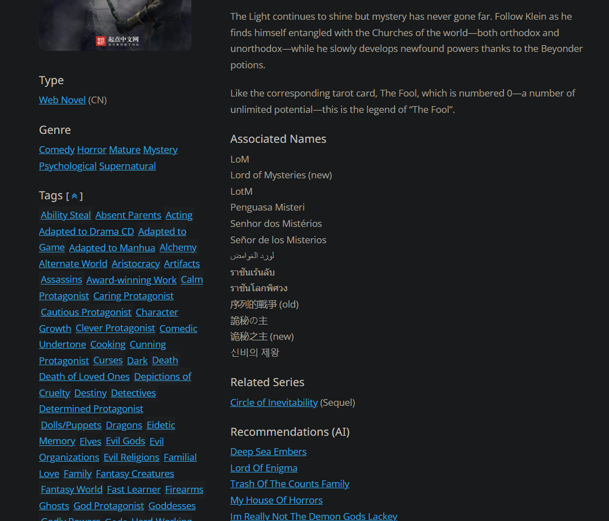

# A browser extension for novelupdates

A browser extension that adds a recommendation series and description for recommendation Lists.

## Demo

## Installation

1. Download the latest zip from [here](https://github.com/shhossain/novelupdates-extension/archive/refs/heads/main.zip)
2. Unzip the file
3. Go to `chrome://extensions/` in your browser
4. Turn on developer mode (top right corner)
5. Click on `Load unpacked` (top left corner)
6. Select the folder you unzipped
7. Go to [novelupdates.com](https://www.novelupdates.com/series/lord-of-the-mysteries/) and enjoy!

## Usage

Go to a novel page on [novelupdates.com](https://www.novelupdates.com/series/lord-of-the-mysteries/)
You should see a new section called `Recommendations (AI)` below the `Related Series` section.

## Advanced Usage

Click on the extension icon, and you will see a popup with the following options:

- Top N: Number of recommendations to show
- Similarity: How much similarity you want to consider
- Rating: If you want to consider the rating
- Rank: If you want to consider the rank
- Save: Save the settings

**NOTE**: You can set rating and rank to `0` if you only want to consider similar novels.

## About

This is a small project created mainly to learn about chrome extensions and recommendation systems. The recommendation system is a simple content-based system that uses the novel's description, genres, tags, rating, and rank to find similar novels. The similarity is calculated using cosine similarity. The recommendation system is running on [pythonanywhere](https://www.pythonanywhere.com/), and the extension is using a simple REST API to get the recommendations. Please note that since I'm using the free tier of pythonanywhere, the API might be slow at times.
